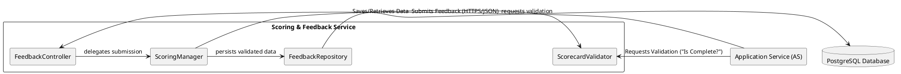

# LTI Software: C4 Diagram - Code (Level 4 - PlantUML)

```plantuml
@startuml SFS_Code_Minimal
hide methods
hide members

' External Components
rectangle "Application Service (AS)" as AS
database "PostgreSQL Database" as DB

' Boundary for the SFS Microservice
rectangle "Scoring & Feedback Service" {
    
    rectangle "FeedbackController" as Controller
    rectangle "ScorecardValidator" as Validator
    rectangle "ScoringManager" as Manager
    rectangle "FeedbackRepository" as Repository
    
    ' Internal Relationships
    Controller -> Manager : delegates submission
    Manager -> Validator : requests validation
    Manager -> Repository : persists validated data
}

' External Relationships
AS -> Controller : Submits Feedback (HTTPS/JSON)
AS -> Validator : Requests Validation ("Is Complete?")
Repository -> DB : Saves/Retrieves Data

@enduml
```
