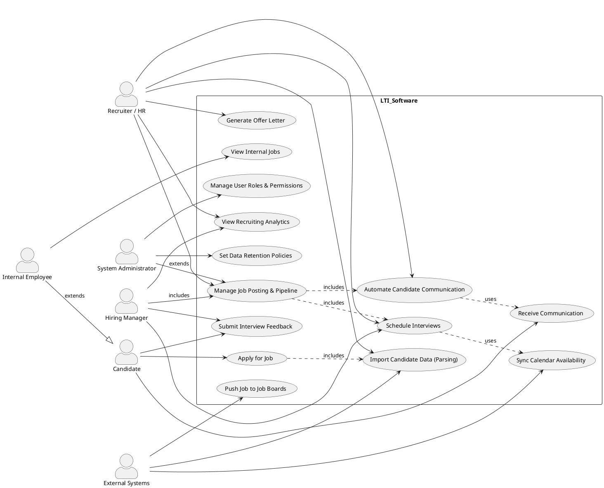

# LTI Software: Use Case Diagram (PlantUML)

```plantuml
@startuml LTI_Software_Use_Case
skinparam actorStyle awesome

left to right direction

actor "Candidate" as Cand
actor "Internal Employee" as IntEmp
actor "Recruiter / HR" as Rec
actor "Hiring Manager" as HM
actor "System Administrator" as Admin
actor "External Systems" as ExtSys

rectangle LTI_Software {
  usecase "Apply for Job" as Apply
  usecase "View Internal Jobs" as ViewInt
  usecase "Receive Communication" as Comm
  usecase "Submit Interview Feedback" as Feed
  usecase "Manage Job Posting & Pipeline" as ManagePost
  usecase "Automate Candidate Communication" as AutoComm
  usecase "Schedule Interviews" as Schedule
  usecase "Generate Offer Letter" as Offer
  usecase "View Recruiting Analytics" as Analytics
  usecase "Manage User Roles & Permissions" as ManageRoles
  usecase "Set Data Retention Policies" as DataPolicy
  usecase "Sync Calendar Availability" as SyncCal
  usecase "Push Job to Job Boards" as PushJob
  usecase "Import Candidate Data (Parsing)" as ImportData
}

' Candidate Flow
Cand --> Apply
Cand --> Comm
Cand --> Feed

' Internal Employee Flow (Specific)
IntEmp --|> Cand : extends
IntEmp --> ViewInt

' Recruiter / HR Flow (Core ATS Management)
Rec --> ManagePost
Rec --> AutoComm
Rec --> Schedule
Rec --> Offer
Rec --> Analytics
Rec --> ImportData

' Hiring Manager Flow (Collaboration & Decision Making)
HM --> ManagePost : includes
HM --> Feed
HM --> Analytics
HM --> Schedule

' External Systems
ExtSys --> SyncCal
ExtSys --> PushJob
ExtSys --> ImportData

' Relationships/Inclusions
ManagePost ..> AutoComm : includes
ManagePost ..> Schedule : includes
Apply ..> ImportData : includes
Schedule ..> SyncCal : uses
AutoComm ..> Comm : uses

' Administrator (Compliance & Setup)
Admin --> ManageRoles
Admin --> DataPolicy
Admin --> ManagePost : extends

@enduml
```
