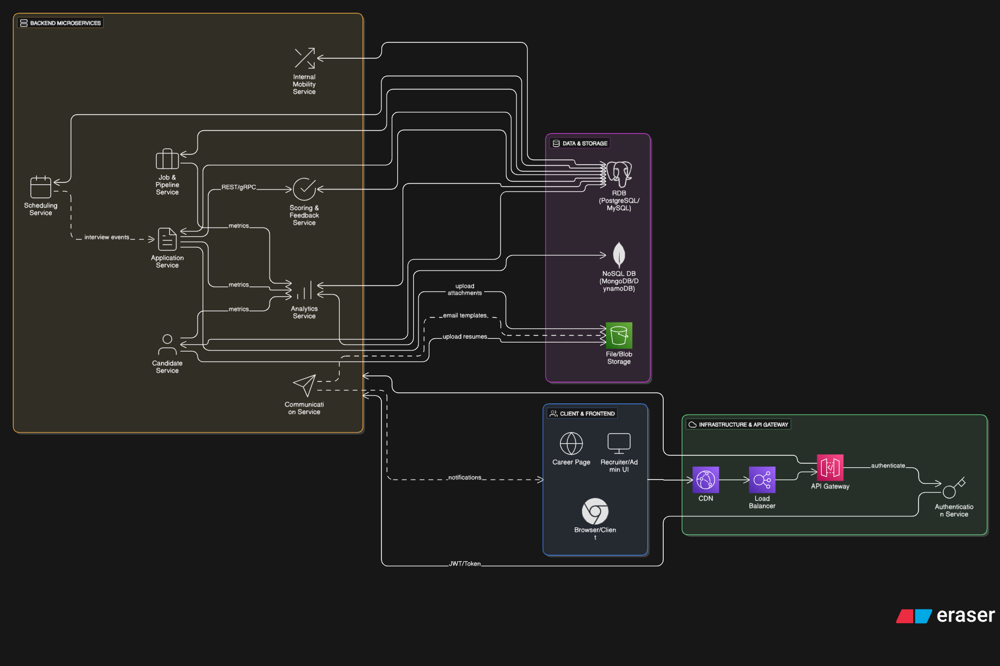

# Optimized ATS Customer Journey for LTI

| Step | Focus/Stage | Key ATS Functionalities (P1-P4) | Structured Hiring/Ease-of-Use Component | P. Level |
| :--- | :--- | :--- | :--- | :--- |
| **1. Job Creation** | **Internal Setup** | * **P2: Internal Collaboration Tools:** Hiring Manager and Recruiter define the job description and ideal candidate profile together. * **P3: Basic Compliance:** EEO/OFCCP data fields are enabled by default for the job posting. | **Structured:** **Job Scorecard Setup.** Define specific, role-related competencies and success criteria *before* the job goes live. | P2 |
| **2. Distribution** | **Sourcing** | * **P1: Branded Career Page:** Job is posted automatically to your customizable page. * **P3: Job Board Posting Integration:** One-click distribution to free/paid boards. * **P2: Internal Job Postings:** Visibility to current employees via a separate internal portal. | **Ease-of-Use:** Single, centralized interface to manage all posting locations with minimal clicks. | P1/P3 |
| **3. Application** | **Candidate Entry** | * **P1: Customizable Pipeline:** Candidate enters the "Applied" stage automatically. * **P1: Candidate Profile Creation/Parsing:** Resume data is captured efficiently, minimizing manual entry for the candidate. * **P2: Automated Acknowledgment:** Immediate, templated email sent to the candidate. | **Ease-of-Use:** Short, streamlined application flow with no required account creation to maximize completion rate. | P1 |
| **4. Screening** | **Initial Review** | * **P1: Centralized Database:** Recruiter views the standardized candidate profile. * **P2: Internal Collaboration Tools:** Recruiter uses a preliminary screening scorecard (based on the Job Scorecard) to log initial notes. | **Structured:** Screeners are trained to only evaluate the specific, predefined **screening criteria** for consistency. | P1/P2 |
| **5. Interview** | **Assessment** | * **P2: Interview Scheduling:** Recruiter uses calendar integration (e.g., Google/Outlook) to send a self-scheduling link to the candidate and team. * **P1: Customizable Pipeline:** Candidate moves to the appropriate Interview stage (e.g., "Hiring Manager Interview"). | **Structured:** **Mandatory Interview Scorecards.** Interviewers must use pre-set, competency-based questions and submit a completed scorecard *before* seeing others' feedback, reducing bias. | P2 |
| **6. Feedback & Consensus** | **Decision Making** | * **P1: Centralized Database:** All feedback, documents, and communications are stored under the candidate's profile. * **P2: Internal Collaboration Tools:** Hiring team reviews *only* the structured scorecards and final notes. | **Structured:** **Debrief Meeting.** The ATS should provide a clear view that flags missing information and shows structured rating comparisons, guiding the team toward a data-driven consensus. | P1/P2 |
| **7. Offer & Close** | **Finalization** | * **P3: Offer Management:** Generate and send a standardized offer letter for e-signature within the system. * **P1: Customizable Pipeline:** Candidate status is updated to "Hired." | **Ease-of-Use:** The offer process is simplified through templating and integrated e-signing, avoiding document management outside the ATS. | P3 |
| **8. Analysis** | **Review & Learn** | * **P3: Reporting & Analytics:** Track key metrics like Time-to-Hire and Conversion Rates by stage for the specific job. * **P4: Recruiting CRM (Talent Pool):** Rejected "silver medalists" are tagged and saved for future roles. | **Structured:** Review the data to see which interview stages or scorecards correlated best with the eventual quality of hire, allowing for continuous process improvement. | P3/P4 |

## 🌟 LTI Software: Overview

LTI Software is a **private Applicant Tracking System (ATS)** designed to help small, high-growth startups implement **structured, unbiased hiring processes** with minimal administrative burden. It combines the collaboration and analytical rigor of enterprise tools with the simplicity and speed required by lean startup teams.

---

### Added Value and Competitive Advantages

| Category | Added Value (What it does for the customer) | Competitive Advantage (Why it's better) |
| :--- | :--- | :--- |
| **Structured Hiring** | Guarantees that every candidate is evaluated against the same **objective criteria** at every stage. | **Bias Reduction at the Core:** Mandates **Scorecards** and structured feedback *before* interview debriefs, ensuring hiring quality is based on data, not gut feeling. |
| **User Experience** | Provides a seamless, clean, and intuitive platform for recruiters, hiring managers, and candidates. | **"Greenhouse Rigor, JazzHR Simplicity":** Designed for **ease-of-use** with minimal training required, reducing friction and speeding up adoption by non-HR employees (Hiring Managers). |
| **Internal Mobility** | Provides a clear, fast track for existing employees to apply for new roles. | **Dual-Track Workflow:** Dedicated, simplified application paths and communication templates for **internal candidates**, improving employee retention and engagement. |
| **Speed & Efficiency** | Automates the most time-consuming administrative tasks, like scheduling and initial communication. | **Quick-Launch Pipelines:** Pre-built, customizable **Kanban-style pipelines** allow startups to post a job and start accepting applications in under 15 minutes. |

---

## 🛠️ Main Functions of LTI Software

### 1. Core Candidate Management (P1 Focus)
* **Resume Parsing & Candidate Profile:** Automatically extracts data from resumes/CVs to create a standardized candidate profile in the system.
* **Branded Career Page:** A customizable, simple interface for hosting all open jobs and managing the application flow.
* **Customizable Pipeline:** Drag-and-drop interface for moving candidates through predefined stages (e.g., Applied, Screen, Interview, Offer).

### 2. Structured Collaboration & Communication (P2 Focus)
* **Mandatory Interview Scorecards:** Custom forms based on job-specific competencies that interviewers *must* complete before seeing others' feedback or finalizing a decision.
* **Automated Communication:** Templated email triggers (e.g., Application Confirmation, Rejection, Interview Invitation) connected to pipeline stage changes.
* **Integrated Scheduling:** Direct two-way sync with Google/Outlook calendars, allowing candidates to self-schedule interviews using pre-set interviewer availability.

### 3. Reporting, Compliance, and Sourcing (P3/P4 Focus)
* **Recruiting Analytics:** Basic reports on key metrics like **Time-to-Hire**, **Conversion Rates by Stage**, and **Source of Hire**.
* **Job Distribution:** Single-point posting to various external job boards (free and paid).
* **Talent Pool/CRM:** Functionality to tag, categorize, and search past candidates ("silver medalists") for future roles.
* **Compliance Tracking:** Fields for tracking EEO data, consent, and data retention rules required for growing companies.

---

## 🖼️ LTI Software: Consolidated Lean Canvas Business Model

| Block | Details for LTI Software |
| :--- | :--- |
| **Problem** | 1. Hiring is subjective and biased. 2. Manual scheduling and candidate communication consumes high time for small teams. 3. Difficulty tracking and nurturing internal talent. 4. Slow, manual processes with a fragmented candidate UI. |
| **Solution** | 1. Mandatory **structured interview scorecards**. 2. Automated scheduling and templated communications. 3. **Dual-track pipeline** for internal/external candidates. |
| **Unique Value Proposition** | **Structured Hiring Simplified:** Implement rigorous, unbiased hiring processes with the **ease-of-use of a startup tool.** |
| **Unfair Advantage** | Proprietary **AI-driven Structured Interview Flow** combined with the founding team's expertise in HR tech and compliance. |
| **Customer Segments** | **Early-Stage** High-Growth Startups (50-250 employees), SMBs, HR Teams prioritizing quality, fairness, and internal mobility. |
| **Key Metrics** | **Time-to-Hire** / Time-Fill Completion Rate, **Conversion Rate** by Stage-to-Stage, Interviewer Feedback Completion Rate, Candidate Satisfaction Rate. |
| **Key Activities** | Product Development, Cloud Infrastructure Management, Sales & Marketing. |
| **Key Resources** | Engineering Talent, Mandatory Scorecard Framework, Biased/Consistent Hiring Methodology, Strong Customer Feedback Loop. |
| **Channels** | Website/Blog, Content Marketing, Social, Referrals, HR Tech Directories, Direct Sales. |
| **Cost Structure** | Cloud Hosting (AWS/Azure), Software Development Salaries, Sales & Marketing Overheads, Legal & Compliance. |
| **Revenue Streams** | Tiered **SaaS Subscription Fees** (based on # users/employees or # jobs), Add-on Modules (Premium features), Custom Integration Fees. |
| **Key Partners** | Job Boards (Indeed, LinkedIn), Calendar APIs (Google/Outlook), E-Signature/HRIS/Payroll Systems. |
| **Customer Relationships** | Self-Serve Onboarding/Chat, In-App Support/Chat, Community Success. |

## 📐 LTI Software: Use Case Diagram (PlantUML)
![LTI Software Use Case Diagram](https://uml.planttext.com/plantuml/png/RLLDRzim3BqRy7yWUjZQGzlx3aMpj5qoj5YGTBiMYiqaGcN9aEHcnhR_FbAoPJljgUNZ4pyUIUVMUM5zKobuV5w-RCpE7uN5bvyEN-R2OPwvLwbhOKK5el36Rdoh4CGHdQd8csSATnwy0Ilt1m-bj5XuQJIxmWCucmjTob9uF0FXWAtaMcgFLWi5zrMjJ8kHGYZPYRJ6mZQIY70DYtLW49JS2scbtiEJq6AFDhWNJycxQPt72cPb9RLqtWf20oSWYNR_koiaybsW44WcTy9D2RsdpiSgmPyy0sWS5gGKdCtgMhMmet3VpJRcO6J2-INn2AbhuiLC31CweLAFADyGvgQg6YqBmR962GcPK3VDjf8-ndtZ30-8vLOKhu7EneGUfUBii3BEitgVO2LhL5B72KG6EwSTDjvKD4X88_sWEYQzhx0uODcGVgd6s7YFJyZVKAFbu3zsEvhw8thV3JO0xmNjDeGRcP6khPT539-iZ_gd7RUmDWeTju-saivH4swaGF1E6q4FTy8BokbHSzEaePA5nFYEVG6OpdtJwe9KKwXBOM7s9gGIMwcaRwCCv2RlvCcgSOSm8pek_lFL25l69EmYQ49VLhMnVZIPKENvIbX7kbp4mmeSTkJPFzxhpoF-WpB7F6CRBYzl-jrDTXnfCkDISOHtDnmYmVccnaBkP76HP_6WwTtVcv0GlW3ImUdIZNmtmnLmsEdLTp7dXgvkzhpfnbFH12WyKSFxyTRssB2DFJAiN8zqMvMU34lJGsFXkBZfDoSLfsYenePJe9Mwe_vveOZsoYF8iyNJIPqaXDI5QahUiiuRbUsCKIqTCfJFXPn-j_8iVhGYjT-g4PPMPuITThT65Nfm1rcxwoKN60uZpqQLNrqDuaxQEE6aonzpugUItKFk2I6z2Y5Y7qIWRUVNVLfsTlcZXwkVVEfvAhIMKkW2QIHqlKrDWmYSqIowEn_WyHcVahl1fGtEirlwXtv2_mC0)

## 🥇 Top 3 Most Important Use Cases for LTI Software

| Priority Rank | Use Case Name | Primary Actor | Rationale for Importance (Startup & Structured Focus) |
| :--- | :--- | :--- | :--- |
| **1** | **Manage Job Posting & Pipeline** | Recruiter / HR, Hiring Manager | **Core Business Need (P1):** This is the fundamental function of any ATS. Essential for job posting, candidate tracking, and workflow management, replacing manual spreadsheets and emails. |
| **2** | **Submit Interview Feedback (Structured)** | Hiring Manager, Internal Employee | **Competitive Advantage (P2 - Structured Hiring):** Implements the Unique Value Proposition. Ensures hiring decisions are based on objective scorecards, directly improving the **Quality of Hire** and reducing bias. |
| **3** | **View Internal Jobs** | Internal Employee | **Strategic Goal (P2/P3 - Internal Mobility):** Supports employee retention and leverages existing talent. Making this path friction-free is a high ROI strategy for a growing company. |

---

## 📝 Use Case Descriptions

### 1. Manage Job Posting & Pipeline

| Detail | Description |
| :--- | :--- |
| **Goal** | To create, publish, distribute, and manage the flow of candidates for a specific open role from application through hiring. |
| **Actors** | Recruiter / HR, Hiring Manager, System Administrator |
| **Pre-conditions** | The job description and hiring team are finalized. The required **Job Scorecard** competencies must be defined. |
| **Main Flow** | 1. Recruiter creates the job and selects the predefined pipeline stages. 2. Recruiter pushes the job to the **Branded Career Page** and external job boards (P1/P3). 3. Hiring Manager views and collaborates on candidates in the pipeline. 4. Recruiter or Manager moves the candidate between customized stages. 5. System triggers automated communications based on stage changes (P2). |
| **Post-conditions** | The job is live and accepting applications. Candidate status is accurately tracked in the **Centralized Database** (P1). |

### 2. Submit Interview Feedback (Structured)

| Detail | Description |
| :--- | :--- |
| **Goal** | To allow interviewers to quickly and objectively evaluate a candidate based on defined competencies and submit a final recommendation. |
| **Actors** | Hiring Manager, Internal Employee (Interviewer), Recruiter / HR |
| **Pre-conditions** | The candidate has completed an interview. The interviewer has been assigned the candidate and the correct **Interview Scorecard** for the specific interview stage. |
| **Main Flow** | 1. Interviewer accesses the candidate profile and the mandatory scorecard. 2. Interviewer rates the candidate on specific, predefined competencies using a standardized scale. 3. Interviewer submits a final "Hire," "No Hire," or "Maybe" recommendation. 4. **(Structured Component):** The system prevents the interviewer from accessing or submitting feedback without rating all mandatory fields. 5. The feedback is logged instantly to the centralized candidate profile (P1). |
| **Post-conditions** | The candidate profile contains a complete, structured record of feedback necessary for the final decision/debrief (P2). |

### 3. View Internal Jobs

| Detail | Description |
| :--- | :--- |
| **Goal** | To provide existing employees with a simple, private way to discover and apply for internal openings. |
| **Actors** | Internal Employee |
| **Pre-conditions** | The employee is logged into the system (or accessed via a verified internal link). The job is flagged for **Internal Posting** (P2). |
| **Main Flow** | 1. Internal Employee navigates to the "Internal Career Portal" view. 2. Employee browses roles, seeing details like department and required skills. 3. Employee clicks "Apply," triggering a **simplified application flow** that requires minimal data entry. 4. Employee receives an automated confirmation tailored for internal applicants (P2). |
| **Post-conditions** | The internal candidate's profile is created/updated in the pipeline, flagged specifically as an internal applicant. |

## 💾 LTI Software: Conceptual Database Model (PlantUML)

![LTI Software Conceptual Database Model](https://uml.planttext.com/plantuml/png/ZLTBR-Cs4BuRy7yWSaWTT1T5hqPJREnu6xTvB2ot2_GICDBO9aAHwf1ArbZqltT8YHBfH-qS4irePhwFywBooLYEjYubkr_EdpEzikySuVcMM_x23Jm_w0BaSB0H1R0Ix4ONffLoWRc4uM0u-85TNr-pp6ubCAuATi-tkhPEEHoOLw4gZhnaKYYmsmgOHWeJlocrqla6TGdCOWtngrnoOzZtuO3HpuJdhslKjIgcMcfaNpV2GlFg1b6_Dzg99BFMGMC1cAZ_xGbFDGARAIki03DcVnf0Jp_R6Wiboy3MLNE8XeKty5H-zC_pMpRwyiULKtpyw7xlA9suq1ASwdEZcfLSIFSmvH9KmJ7RglnUg42i1tAECLW8b00-SahPwAOeXVh05f1ZJGd13-pkuIe9UAzpReLM8M2Gzm9EXTtwlvHaY_vnAKhuMoj80cQwnhpZrqX7sBdJGJ7t15U0oAKtQNoMr0z9JNxNB-o1Axw64fIDi-_Uj7Zqk0Us55RwNeZFrcPzYi0j59DjA52hdvkvedmfBf-KtBBHH5EIkKfpzqLKu5etiqGgC4YKUrnQVYsAIuC_CVnJWyhXoVLa0a7sMKxDc7CieZDskXC0KrrMO2dqDa3D3UMmu5Qx4gP0TmA5MY-1Pgj7wfKde7OIw9jqTB3nsX4Z6eA80BjaTy8uGd5D-zSjbqwnnwElrQoifDu2nFMA9ci1fYvX2TziSlGkyknR1IXS8G9ehzcVXvXFU-YkqrpUkUgIdhb5IdiJZk0MTJg4dU8irBaojAXgPny0Rs6DS0GjUnLITlFfXBDGl6KJFuewcpsv-w0ZteXd1Lpmt7FzZRPTr_LDRznKbHHjIYxPLuslAwdVu_Q8BLhiI7KM_iwar8YqLhgf3QVkzbUhS5MacO0YIODlm3S1xvy1YXUwJGAf8Eynsc7RSqf6kwjm6nvmTymeWbh_nMMzKvTs4i9Y3No2V2QVnfmG4jYeKWkGtiTiH6MQ0hbN_Zwyz4l0_EJMiriWmu5NN_nyGPZiul6Ylyt6RCCD-tNV8brBOoOCezlVChqwOaqsURFJdO7ZufGPVJpajaPAaXCZbtI7Zra1Av8ybntBP1MVC4muWwz5R_dOM993T_dwWqad4M-Xs2yDzNu9jXjoEEXL4UAX3TQbz8H7jtlET6ZMn_yOqv-m5SQiGlr6NuGc52EUM_-HDLfkW4rG56kuEW8T-umPTn85jFf0wbDJgXM8jmOyhVDH5of3tcm2klMvTPxj1yrH5urYBPIlt8e-LCD9kwrrsIs1uI3sZ0BkhuynMuC2fAYU_I4_b-VTAVS7u8T6un24gLzAOTjHIThxX6F3AqTtiuk3S0UOeNyCS_c9jZxzQ_4V)

## 💻 LTI Software: Required Component List

| Layer | Component | Description / Technology Focus | Alignment with ATS Goal |
| :--- | :--- | :--- | :--- |
| **I. Client & Frontend** | | | |
| **Recruiter/Admin UI** | Web Application Framework (e.g., React, Vue.js) | Main application interface for recruiters and hiring managers. | **Ease of Use (JazzHR Focus).** High focus on data visualization and complex pipeline management. |
| **Candidate Portal/Career Page** | Static Site Generation (e.g., Next.js) | Public-facing portal for viewing jobs and submitting applications. | **Candidate Experience.** Must be fast, mobile-friendly, and branded. |
| **Browser/Client** | Standard web browsers (Chrome, Firefox, Safari) | The end-user access point. | |
| **II. Infrastructure & API Gateway** | | | |
| **CDN (Content Delivery Network)** | AWS CloudFront / Cloudflare | Caching and distribution of static assets (images, CSS, JS) globally. | **Speed & Experience.** Ensures fast load times for the public Career Page. |
| **Load Balancer** | AWS ELB / Nginx | Distributes incoming traffic across multiple instances of the API Gateway or individual services. | **High Availability.** Prevents service disruption during traffic spikes. |
| **API Gateway** | AWS API Gateway / Kong | **Single Entry Point.** Handles routing, rate limiting, and initial request validation/authentication. | **Security & Centralization.** Protects backend microservices. |
| **Authentication Service** | Auth0 / Keycloak / Dedicated Microservice | Handles user sign-up, login, token generation (JWT), and authorization checks. | **Security.** Ensures only authorized users access internal tools. |
| **III. Backend Microservices** | | | |
| **Job & Pipeline Service** | REST/gRPC API (Python/Java) | Manages `Job` creation, `PipelineStage` configuration, and job distribution. | **P1 Core Functionality.** |
| **Candidate Service** | REST/gRPC API (Python/Java) | Manages the **Candidate** profiles and structured history entities (`Experience`, `Education`). | **P1 Core Functionality & CRM.** |
| **Application Service** | REST/gRPC API (Python/Java) | Manages the `Application` entity, status changes, and core workflow. | **P1 Core Workflow.** |
| **Scoring & Feedback Service** | REST API (Python/Java) | Manages `JobScorecard` and `InterviewFeedback` logic. | **Structured Hiring (Greenhouse Focus).** Implements core bias-reduction logic. |
| **Communication Service** | REST API (Go/Python) | Manages `Template` and sends automated emails/notifications via a provider (e.g., SendGrid). | **P2 Automation.** |
| **Scheduling Service** | REST API (Python/Java) | Handles calendar integrations (Google/Outlook) and interview scheduling logic. | **P2 Automation.** |
| **Internal Mobility Service** | REST API (Python/Java) | Handles internal applicant verification and `EmployeeReferral` tracking. | **P3 Strategic Goal.** |
| **Analytics Service** | REST API (Python) | Aggregates data for reporting (`Time-to-Hire`, `Source-of-Hire`). | **P3 Reporting.** |
| **IV. Data & Storage** | | | |
| **Relational Database (RDB)** | PostgreSQL / MySQL | Primary database for transactional data (`Job`, `Candidate`, `Application`, `Feedback`). | **Data Integrity.** Essential for reliable tracking and compliance. |
| **NoSQL Database** | MongoDB / DynamoDB | Used by the **Analytics Service** for fast, flexible aggregation of large datasets. | **Performance.** Optimized for reporting speed. |
| **File/Blob Storage** | AWS S3 / Azure Blob Storage | Stores unstructured files like resumes, documents, and other candidate materials. | **Scalability & Compliance.** |

---

## 🏗️ LTI Software: Microservice Architecture Diagram

## 💾 LTI Software: C4 Diagram (PlantUML)

### Context (Level 1)

![LTI Software: C4 Diagram - Context](https://uml.planttext.com/plantuml/png/ZLHDZzem4BqZyH-c75P1OfFBddfQbhAGYkr697JL4t8I4rmS6tbiTcdL_zvnmaUsLQLoYJsCtvjvR-nxjCnOLqkOtAqdMbd-Plkz3q8LqfKSjjRkyMCK6VOQLi9kNUwGcyBdAHiMkexsaYb__XPjAKKUJUvk4nzQFIsYcg7b9heYXtlAxFVwlSNus_CgMx_4sNozcCwcNpu5GnzFk46jWYKlZ1DqTWI3opgQBmUqVsAALHpXkyvn10LJfIYPvRJ6GXjUC5FIci9GintbROKHgeAI5mA5LXWEXXUUoVaquKxVY4Cn6SMgNS3bNqyxtk-b8BYDDYTgukBYG27chAufhGGIf7PA5CnwfX7iZJw8abA4npm8_WeRpikS5RkcZ7ulFP94zVf1ErKoSmp6MKfaYoo6L6_iApCSA0Hjsc08F_ize5-x3oZlZsnVQhRbn2mEL18qPPD85Z93h5w9zcpJ25hZ2kiCbTxAr5JrwrfOy5dd3xgLzA8GK13QgAVZOHMEO27KZfUn6a6iIkfn13F944kjJKZLELDmq1lWPmnsBgmrv4GtOP9x8SQ9R-oy0zfUcMPQLv97pyvAhNSXh93AzzrSHSPYoqidVRT-4DY12Sbo8OKz0XvLqQMSBsClkVz42JiQBULPRWe_EYzF0rsPnbQm6hJAVVjWIUcvyF9TPgKBFKRaY3LTbKnhwIMyHgA7sGI-KdlQu3-86eTsGae4cc-BJIz-TYhZnmMeoMA7fq5QSjczDkraa3G8mVd6l6YpsqZzElHyBpo7LGp1FCkITEWnF4BdGhG8gSjhGTIdEMhgEWXsHaYqiMHc1wN5QGvtPoTnkAKI_EGa6YqvWt03Jre9Im9quHiroF28yBTaC9vhQp3V3qXANjBXhhqta582qXGUI8a6R3bDisQ4ka0ds-bMADpGQm2FWiPI_20llQD0McfJTfmX08WxxWJ9tV0TujzkPqPKbSVE6ljkF6ZxP2mvEcdnF-3xlNlgXvxDtm00)

### Containers (Level 2)

![LTI Software: C4 Diagram - Containers](https://uml.planttext.com/plantuml/png/VLNTR-9647-FbFzXoXD85rPjx-cUpa1oa9ASYurGdwBrUi5xCRjqFqYuglzxPsmCDaaQ2MLtTcP-l_dqL-UvzM5RmlZpqzXepvMMrbrV_QAqA4CkeV1-vxumPldBSADy4RBWf1MeAhKV2hDbkv9hSd7ZV5wgZ8q_tyGaMZxCsPOxBorhEn_kKFVwwlfg7ltrVPa-hMRfz6b---tsST8Va3n60aRt5rBOeD3w4_HEPpPTz0OdbJ7NkSgvbwXo-uhFcfTifki3d5vxbTlaW5IsJoCJTCxjeH-b2PhDqnaaPkrVk9M08gZLUWFuv_eAyE_4-qneEUjGYlAjqh2SzIef5nvMCeDejoD1MaX8bDwK4cA-aIGkbU1U6Gtz98u6i3OMLCEPSkk6HBYBVOebDjRp4XsV952B2EnHllhX3mSC4eyG0gR6UGI7lU8mdZoIJXmo972pve8UTfLjnO4ZimF9q34Qo1Sw_p1PJUUIqDpmVCInpA8g45sXkRDLT4TGqIg1s_c8FMwKVYN1H3blLHQyTE0jNw-H8g7jhDch78LAAw-GZvCYMEKFKF83Tinx1A9uzWsZV-47GefdSBmHpXy6gJCW_8kNOocmTUq1WyUy3s6A54e4jvJCKcsLRx9WJQ3p-_Z15ucqUoMe--Y6JflA7X-gV1zyWP879QnnP_43rzWEhYeuyAvr_twLWd8kK3O75HFIC5Rzh1HE_N79gGtY2AHzXt4PQ1ZFfDWzt_EgK6K9mXm70ESRdJa7fTaeyH7M9El7s5mRAzraH7rkkNRO-qWFwpVXdcVSrGcerP8_vrK1FEAu6WsxbsEms6AVsdE1jpifyuoBvy7RKK3WKMaoyeC9H8zt2Wjwl3PTb_pEefy18KYr1Ok_iCN_b5AdDbhca1k18ktVcJg46dDHo6hQH56Zo7hCS-LwZTpHc63dE7_qZDcZEb9ybTT_p_k7mXqPRdFNsbc0GgYbTQijPDdUVztDiqJ_f4PAhGtuTaL40ij-LBxmIOukHdWX_mwIGcYlA2eanJbDqpXXzydtnpV83Tn7xYYskQhsa6D9o72-NBCTksvhnrq_dJ5Vc6frfFNgQ9YqLRfJ-UiGMeE9bfWworBpBFLxnfVZyziGZeYdOFhDruKrjHkScL_OT-O3FmovOojSQdK05yFIqBbmqUtqXE-bOmk9ErJY2IPDwtvWtJHl1xiIvly7skxGEBYYmXHI4IH-sGfZdglUZzn1Yy8QRSAnnRvAdUF7_Jy0)

### Components (Level 3)

### Code (Level 4)

