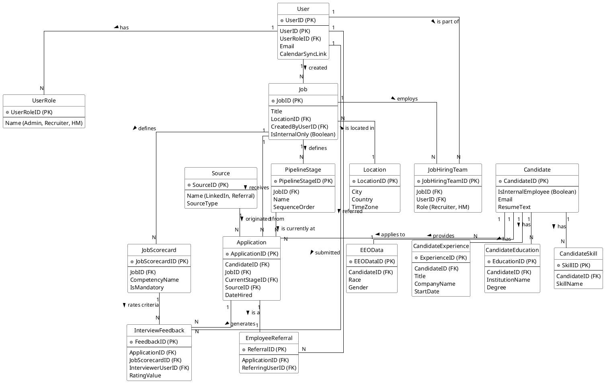

# LTI Software: Database Model (PlantUML)

```plantuml
@startuml LTI_Software_Database_Model
hide methods
hide circle

' === Style and Layout ===
skinparam linetype ortho
skinparam monochrome true
skinparam class {
    BackgroundColor White
    ArrowColor Black
    BorderColor Black
}

' === Core Entities: User and System Setup ===
class User {
  + UserID (PK)
  --
  UserID (PK)
  UserRoleID (FK)
  Email
  CalendarSyncLink
}

class UserRole {
  + UserRoleID (PK)
  --
  Name (Admin, Recruiter, HM)
}

class Location {
  + LocationID (PK)
  --
  City
  Country
  TimeZone
}

class Source {
  + SourceID (PK)
  --
  Name (LinkedIn, Referral)
  SourceType
}

' === Job Management ===
class Job {
  + JobID (PK)
  --
  Title
  LocationID (FK)
  CreatedByUserID (FK)
  IsInternalOnly (Boolean)
}

class PipelineStage {
  + PipelineStageID (PK)
  --
  JobID (FK)
  Name
  SequenceOrder
}

class JobScorecard {
  + JobScorecardID (PK)
  --
  JobID (FK)
  CompetencyName
  IsMandatory
}

class JobHiringTeam {
  + JobHiringTeamID (PK)
  --
  JobID (FK)
  UserID (FK)
  Role (Recruiter, HM)
}

' === Candidate & History ===
class Candidate {
  + CandidateID (PK)
  --
  IsInternalEmployee (Boolean)
  Email
  ResumeText
}

class CandidateExperience {
  + ExperienceID (PK)
  --
  CandidateID (FK)
  Title
  CompanyName
  StartDate
}

class CandidateEducation {
  + EducationID (PK)
  --
  CandidateID (FK)
  InstitutionName
  Degree
}

class CandidateSkill {
  + SkillID (PK)
  --
  CandidateID (FK)
  SkillName
}

class EEOData {
  + EEODataID (PK)
  --
  CandidateID (FK)
  Race
  Gender
}

' === Application & Workflow ===
class Application {
  + ApplicationID (PK)
  --
  CandidateID (FK)
  JobID (FK)
  CurrentStageID (FK)
  SourceID (FK)
  DateHired
}

class InterviewFeedback {
  + FeedbackID (PK)
  --
  ApplicationID (FK)
  JobScorecardID (FK)
  InterviewerUserID (FK)
  RatingValue
}

class EmployeeReferral {
  + ReferralID (PK)
  --
  ApplicationID (FK)
  ReferringUserID (FK)
}

' === Relationships ===

' User & Roles/Job Team
User "1" -- "N" UserRole : has >
User "1" -- "N" JobHiringTeam : is part of >
User "1" -- "N" Job : created >

' Job Structure
Job "1" -- "N" PipelineStage : defines >
Job "1" -- "N" JobScorecard : defines >
Job "1" -- "N" JobHiringTeam : employs >
Job "N" -- "1" Location : is located in <

' Candidate History
Candidate "1" -- "N" CandidateExperience : has >
Candidate "1" -- "N" CandidateEducation : has >
Candidate "1" -- "N" CandidateSkill : has >
Candidate "1" -- "1" EEOData : provides >

' Application Core (The Bridge)
Candidate "1" -- "N" Application : applies to >
Job "1" -- "N" Application : receives >
PipelineStage "1" -- "N" Application : is currently at >
Source "1" -- "N" Application : originated from >

' Workflow & Feedback
Application "1" -- "N" InterviewFeedback : generates >
Application "1" -- "1" EmployeeReferral : is a >
User "1" -- "N" InterviewFeedback : submitted >
JobScorecard "1" -- "N" InterviewFeedback : rates criteria >
User "1" -- "N" EmployeeReferral : referred >

@enduml
```
